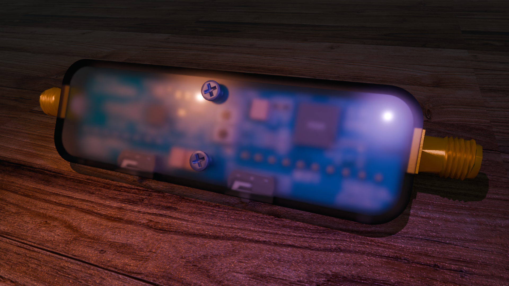
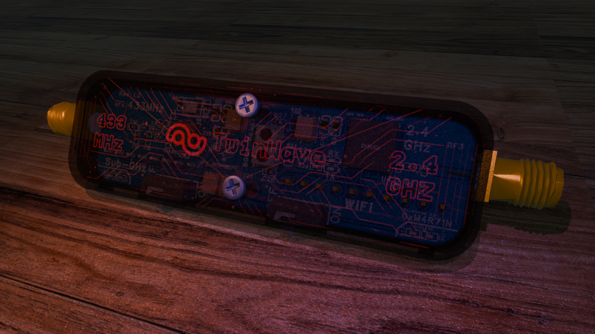
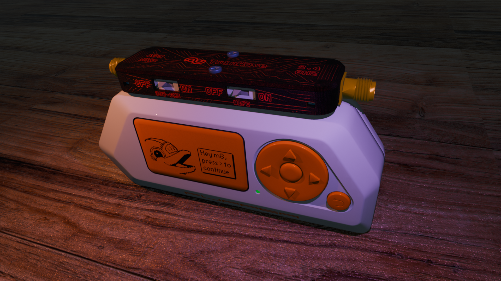
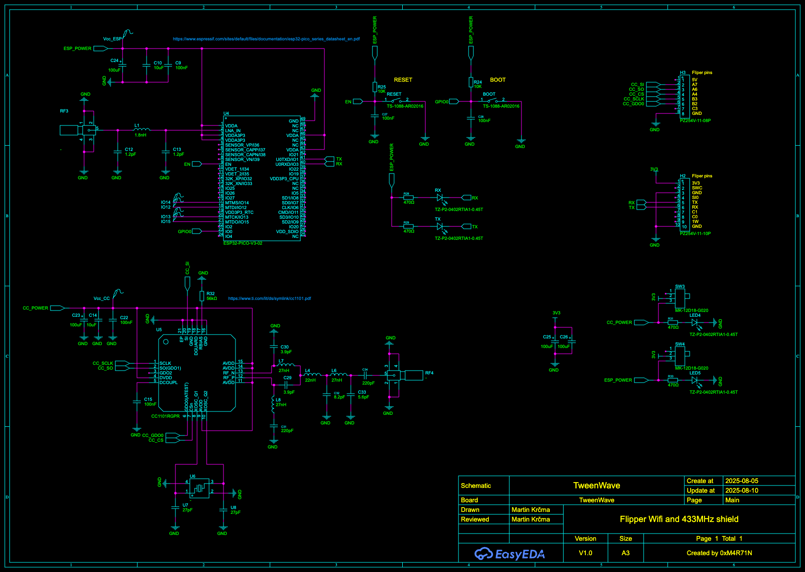
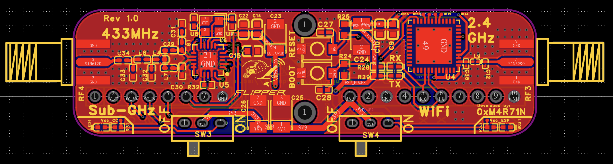
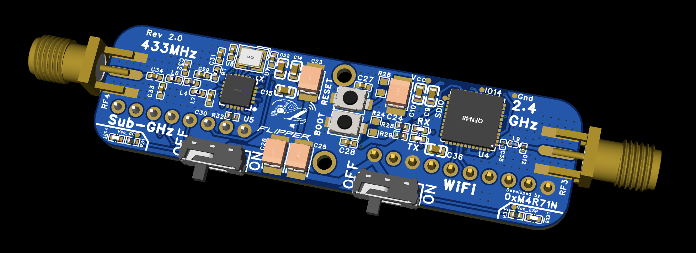

# GPIO Wi‑Fi + Sub‑GHz Module for Flipper Zero 🔌📡

[](#features)
[](https://github.com/justcallmekoko/ESP32Marauder)
[](#)
[](#)

<p align="center">
    
    
</p>
<p align="center">
    
</p>

A compact GPIO add‑on for Flipper Zero that combines 2.4 GHz Wi‑Fi and 433 MHz Sub‑GHz into one board. Perfect for lab experiments, RF tinkering, and extending Flipper’s connectivity.

---

## Highlights

- 🧩 Direct plug‑in to Flipper Zero GPIO
- 📶 Wi‑Fi 2.4 GHz via ESP32‑PICO‑V3‑02  
    - Compatible with ESP32 Marauder firmware
- 📻 Sub‑GHz 433 MHz via TI CC1101
- 📡 External antennas using 2× SMA female connectors (one for Wi‑Fi, one for 433 MHz)
- 🧱 Small footprint, careful RF layout
- 🔄 ESP32 firmware updatable over UART (USB‑TTL)

---

## Specifications

- Radios
    - Wi‑Fi: 2.4 GHz (ESP32‑PICO‑V3‑02)
    - Sub‑GHz: 433 MHz (TI CC1101)
- Antennas: 2× SMA female (Wi‑Fi + 433 MHz)
- Power: from Flipper GPIO (3V3, GND)
- Interfaces
    - ESP32: UART/Serial from Flipper GPIO (for control/logs), flashing via external USB‑TTL
    - CC1101: SPI bus (see schematic)
- Indicators: status/power LEDs as routed on PCB
- Compatibility: Flipper Zero with GPIO header

Note: exact pin mapping and signals are shown in the schematic below.

---

## Quick Start

1. Attach suitable antennas:
     - 2.4 GHz antenna to the Wi‑Fi SMA
     - 433 MHz antenna to the Sub‑GHz SMA
2. Plug the module onto GPIO
3. Enable the Wi‑Fi or Sub‑GHz power switch on the module
4. Use Flipper’s serial/terminal to interact with ESP32 or integrate the CC1101 into your Sub‑GHz workflows

---

## ESP32 Marauder (short guide)

- Project: https://github.com/justcallmekoko/ESP32Marauder
- Typical flashing flow (adjust per Marauder docs and your OS/ports):
    ```
    esptool.py --chip esp32 --port /dev/ttyUSB0 --baud 921600 write_flash -z \
        0x1000 bootloader.bin \
        0x8000 partitions.bin \
        0x10000 marauder.bin
    ```
- Enter bootloader using BOOT/EN pads or buttons provided on the board, then reset and open a serial terminal to confirm logs.

Always follow Marauder’s official instructions for correct binaries and offsets.

---

## Technical Views

<p align="center">
    
</p>

<p align="center">
    
    
</p>

> All renders are available under doc/render/.

---

## RF, Safety, and Compliance

- Use properly tuned antennas for 2.4 GHz and 433 MHz.
- Do not transmit without an antenna connected to avoid RF stage damage.
- Observe local regulations and duty‑cycle/ERP limits for ISM bands.
- Regulatory status: not certified. For lab/experimental use only. User is responsible for legal compliance and safe operation.
- Do not use in life‑support, safety‑critical, or mission‑critical systems.

---

## FAQ

- Does it support Marauder?  
    Yes. The ESP32‑PICO‑V3‑02 is wired for ESP32 Marauder support.

- Is CC1101 fixed to 433 MHz only?  
    The design and matching are optimized for 433 MHz. CC1101 can target other sub‑GHz bands, but follow the schematic/matching network and your local regulations.

- Where is the pinout?  
    See the schematic (doc/sch.png).

---

## Author

- 0xM4R71N

---

## License and Disclaimer

Summary (non‑binding): personal, non‑commercial use only; no warranty; you are responsible for safe use and legal compliance.

Legal terms:

- License (Non‑Commercial, Personal, Attribution)
    - Copyright (c) 2025 Martin Krčma (0xM4R71N)
    - Permission is granted to use, view, and modify the hardware design files for personal, experimental, and non‑commercial purposes only.
    - Commercial manufacturing, distribution, or sale of the hardware, derivatives, or prebuilt devices is prohibited without prior written consent from the author.
    - When redistributing modified files for personal/non‑commercial use, retain this notice and attribute “0xM4R71N”.
- Warranty Disclaimer
    - The design, files, and documentation are provided “AS IS”, without warranties or conditions of any kind, express or implied, including but not limited to merchantability, fitness for a particular purpose, and non‑infringement.
- Limitation of Liability
    - To the maximum extent permitted by law, in no event shall the author or contributors be liable for any direct, indirect, incidental, special, exemplary, or consequential damages (including, but not limited to, loss of use, data, business, or profits; personal injury; property damage; or regulatory penalties) arising from or related to the use, misuse, or inability to use this design, even if advised of the possibility of such damages.
- User Responsibility and Compliance
    - You are solely responsible for evaluation, safe assembly, testing, operation, and compliance with applicable laws, regulations, and standards (including RF spectrum use and EMC).
    - Not intended for life‑support, safety‑critical, or high‑risk environments.
- Miscellaneous
    - This notice is not legal advice. For commercial licensing or special permissions, contact the author.
    - Trademarks (e.g., “Flipper Zero”, “ESP32”) belong to their respective owners and are used for identification only.
